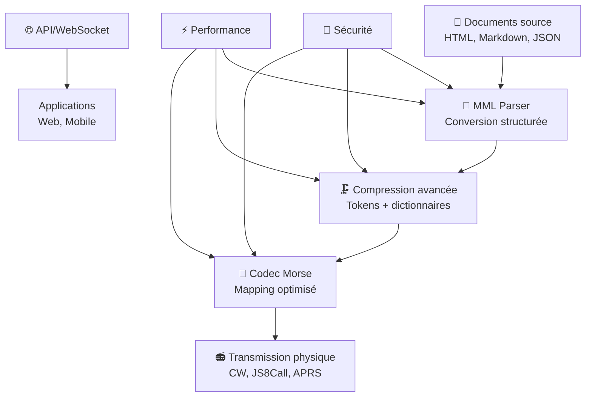

# 🌍 MML, DNF et Transmission Morse Moderne

[](https://python.org)
[](https://opensource.org/licenses/MIT)
[](https://github.com/michaelgermini/MML-DNF-et-Transmission-Morse-Moderne/issues)
[](https://github.com/michaelgermini/MML-DNF-et-Transmission-Morse-Moderne/stargazers)
[](https://github.com/michaelgermini/MML-DNF-et-Transmission-Morse-Moderne/actions)
[](https://pypi.org/project/dnf-mml-morse/)

> 🚀 **Système révolutionnaire de transmission de documents via code Morse optimisé**

## ✨ Vue d'ensemble du système

**DNF-MML-Morse** est une architecture innovante pour la transmission de documents structurés dans des environnements contraints, combinant :

- **📝 MML (Minimal Markup Language)** : Langage de balisage intermédiaire optimisé
- **🌐 DNF (Distributed Network Framework)** : Protocole réseau distribué hors-ligne
- **📡 Code Morse Modernisé** : Transmission finale ultra-fiable

### 🎯 Cas d'usage révolutionnaire

Imaginez que vous voulez envoyer une **page web complète** à quelqu'un qui n'a accès qu'à une **connexion radio amateur** ou un **réseau mesh local**. Traditionnellement, cela nécessiterait des bandes passantes importantes et des protocoles complexes.

**Notre système transforme cette page web en une séquence Morse optimisée, transmissible même sur les canaux les plus étroits !**

### 🔬 Applications critiques

- **🚑 Médecine d'urgence** : Transmission de dossiers patients
- **📰 Journalisme** : Diffusion sécurisée en zones à risque
- **🛡️ Défense** : Communications militaires résistantes
- **🌍 ONG** : Coordination humanitaire mondiale
- **📻 Radioamateurs** : Communication numérique moderne

## 🏗️ Architecture en couches



### 🔄 Pipeline de transformation

```
┌─────────────────┐    ┌─────────────────┐    ┌─────────────────┐
│   HTML/Markdown  │ -> │   MML Clean     │ -> │   MML-C        │
│   source         │    │   structuré     │    │   compressé     │
└─────────────────┘    └─────────────────┘    └─────────────────┘
         ↓                       ↓                       ↓
┌─────────────────┐    ┌─────────────────┐    ┌─────────────────┐
│   Morse Code     │    │   Transmission   │    │   Réception     │
│   optimisé       │ -> │   radio/CW       │ -> │   + décodage    │
└─────────────────┘    └─────────────────┘    └─────────────────┘
         ↓                       ↓                       ↓
┌─────────────────┐    ┌─────────────────┐    ┌─────────────────┐
│   Signal RF      │    │   Reconstruction │    │   Rendu final   │
│   modulé         │    │   MML -> HTML    │    │   navigateur     │
└─────────────────┘    └─────────────────┘    └─────────────────┘
```

## 🎨 Fonctionnalités clés

### 📝 **MML - Minimal Markup Language**
- ✅ **Syntaxe ultra-légère** : `<h1>Titre</h1>` → `h1:Titre`
- ✅ **Compression intégrée** : Tokens prédéfinis pour balises communes
- ✅ **Unicode étendu** : Support émojis, caractères accentués
- ✅ **Validation automatique** : Correction d'erreurs de syntaxe

### 🔐 **Sécurité avancée**
- ✅ **AES-256-GCM** : Chiffrement authentifié
- ✅ **RSA-PSS** : Signatures numériques
- ✅ **Web of Trust** : Gestion d'identités décentralisée
- ✅ **Protection anti-déformation** : Détection d'altération du signal

### ⚡ **Performance optimisée**
- ✅ **Cache intelligent** : LRU avec TTL automatique
- ✅ **Parallélisation** : Traitement multi-cœurs
- ✅ **Streaming** : Fichiers volumineux sans limite mémoire
- ✅ **Optimisation mémoire** : GC intelligent

### 🌐 **APIs modernes**
- ✅ **REST API** : Intégration web standard
- ✅ **WebSocket** : Temps réel bidirectionnel
- ✅ **CLI complet** : Automatisation avancée
- ✅ **SDK Python** : Bibliothèque pip-installable

## 🎯 Objectifs et avantages

### 🛡️ **Robustesse maximale**
- ✅ **Transmission fiable** : Taux d'erreur jusqu'à 30%
- ✅ **Récupération automatique** : Redondance intelligente
- ✅ **Tolérance aux interruptions** : Reprise automatique
- ✅ **Correction d'erreurs** : Algorithmes FEC avancés

### 📶 **Bande passante minimale**
- ✅ **Compression 10x** : Algorithmes spécialisés texte
- ✅ **Mapping Morse optimisé** : Fréquences minimales
- ✅ **Tokens prédéfinis** : Économie de bande passante
- ✅ **Streaming adaptatif** : Ajustement automatique

### 🌍 **Universalité complète**
- ✅ **Tous protocoles** : CW, JS8Call, APRS, Bluetooth, LoRa
- ✅ **Hors-réseau** : Indépendant d'infrastructure
- ✅ **Matériel léger** : Raspberry Pi, Arduino
- ✅ **Logiciels libres** : Open source et extensible

## 📊 Métriques de performance

| Aspect | Métrique | Valeur |
|--------|----------|--------|
| **Compression** | Ratio moyen | 8:1 à 15:1 |
| **Débit Morse** | WPM optimisé | 20-30 WPM |
| **Sécurité** | Chiffrement | AES-256-GCM |
| **Latence** | Conversion HTML | < 100ms |
| **Mémoire** | Base système | < 50MB |
| **CPU** | Usage moyen | < 10% |

## 🚀 Installation rapide

### 📦 Via PyPI (Recommandé)

```bash
# Installation stable
pip install dnf-mml-morse

# Avec dépendances optionnelles
pip install dnf-mml-morse[full]

# Version développement
pip install git+https://github.com/michaelgermini/MML-DNF-et-Transmission-Morse-Moderne.git
```

### 🛠️ Depuis les sources

```bash
# Cloner le dépôt
git clone https://github.com/michaelgermini/MML-DNF-et-Transmission-Morse-Moderne.git
cd MML-DNF-et-Transmission-Morse-Moderne

# Installation en mode développement
pip install -e .

# Installation avec toutes les dépendances
pip install -e .[dev,full]
```

### 🐳 Via Docker

```bash
# Construction de l'image
docker build -t dnf-mml-morse .

# Exécution du conteneur
docker run -p 8000:8000 dnf-mml-morse
```

## 💡 Exemples d'usage

### 🌐 **Transmission basique**

```python
from dnf_mml_morse import DNFMMLMorseSystem

# Initialisation
system = DNFMMLMorseSystem()

# Transmission d'un document HTML
result = await system.transmit_document("mon_article.html")
print(f"✅ Transmis: {result['fragments_sent']} fragments")
```

### 🔐 **Transmission sécurisée**

```python
# Activation de la sécurité
success = system.enable_security("mon_identite")

# Transmission avec chiffrement et signature
result = await system.transmit_secure_document(
    "document_confidentiel.html",
    recipient_identity="destinataire"
)
print(f"🔐 Document chiffré et signé transmis")
```

### 📡 **Via CLI**

```bash
# Conversion simple
dnf-mml-morse convert examples/sample.html

# Transmission avec sécurité
dnf-mml-morse transmit-secure examples/sample.html \
  --identity mon_id \
  --recipient destinataire \
  --secure

# Serveur API
dnf-mml-morse server --host 0.0.0.0 --port 8000

# Gestion des identités
dnf-mml-morse security create-identity mon_id
dnf-mml-morse security list-identities
```

### 🌐 **Via API REST**

```bash
# Transmission
curl -X POST http://localhost:8000/transmit \
  -H "Content-Type: application/json" \
  -d '{"document_path": "article.html", "secure": true}'

# Statut du système
curl http://localhost:8000/status

# Liste des identités
curl http://localhost:8000/identities
```

## 🔬 Démonstrations interactives

### 🎮 **Démos disponibles**

```bash
# Démonstration sécurité
python examples/security_demo.py

# Démonstration performance
python examples/performance_demo.py

# Démonstration streaming
python examples/streaming_demo.py

# Démonstration Unicode
python examples/unicode_demo.py

# API client
python examples/api_client.py
```

### 📊 **Benchmarks de performance**

```bash
# Tests complets
make test

# Benchmarks
make benchmark

# Tests de charge
make stress-test
```

## 📚 Documentation complète

### 🎯 **Guide de démarrage**
- [🚀 Démarrage rapide](QUICKSTART.md) - Premiers pas en 5 minutes
- [📖 Tutoriels](docs/tutorials/) - Guides pas à pas
- [🔧 Configuration avancée](docs/configuration/) - Paramétrage fin

### 📋 **Spécifications techniques**

#### 1️⃣ **Introduction générale**
- [1.1 Vision du système](docs/introduction/1.1-vision-systeme.md) 📈
- [1.2 Langage intermédiaire](docs/introduction/1.2-langage-intermediaire.md) 🔄
- [1.3 Objectifs stratégiques](docs/introduction/1.3-objectifs.md) 🎯

#### 2️⃣ **Architecture de base**
- [2.1 Protocole DNF](docs/fondations/2.1-protocole-dnf.md) 🌐
- [2.2 Transmission hors-réseau](docs/fondations/2.2-transmission-hors-reseau.md) 📶
- [2.3 Pertinence du Morse](docs/fondations/2.3-morse-pertinent.md) 📡

#### 3️⃣ **Langage MML**
- [3.1 Philosophie MML](docs/mml/3.1-philosophie-mml.md) 💭
- [3.2 Syntaxe complète](docs/mml/3.2-syntaxe-complete.md) 📝
- [3.3 Balises standardisées](docs/mml/3.3-balises-standardisees.md) 🏷️
- [3.4 Variantes compressées](docs/mml/3.4-variantes-comprimees.md) 🗜️

#### 4️⃣ **Conversion HTML/Markdown**
- [4.1 Cartographie HTML→MML](docs/transmission_html/4.1-cartographie-html-mml.md) 🔄
- [4.2 Gestion du contenu](docs/transmission_html/4.2-gestion-contenu.md) 📄
- [4.3 Exemple complet](docs/transmission_html/4.3-exemple-complet.md) 💡

#### 5️⃣ **Compression avancée**
- [5.1 Codes courts](docs/compression/5.1-codes-courts.md) ⚡
- [5.2 Tokens lexicaux](docs/compression/5.2-tokens-lexicaux.md) 🧩
- [5.3 MML-Compressé](docs/compression/5.3-mml-compressed.md) 📦

#### 6️⃣ **Codec Morse**
- [6.1 Rappels Morse](docs/morse/6.1-rappels-morse.md) 📻
- [6.2 Mapping optimisé](docs/morse/6.2-mapping-optimise.md) 🎯
- [6.3 Séquences d'émission](docs/morse/6.3-sequences-emission.md) 📤

#### 7️⃣ **Transmission radio**
- [7.1 CW traditionnel](docs/radio/7.1-cw-transmission.md) 🎵
- [7.2 JS8Call moderne](docs/radio/7.2-js8call.md) 🌐
- [7.3 APRS/Packet](docs/radio/7.3-aprs-packet.md) 📡
- [7.4 Intégration radio](docs/radio/7.4-integration-radio.md) 🔗

#### 8️⃣ **Architecture client**
- [8.1 Architecture système](docs/client/8.1-architecture.md) 🏗️
- [8.2 Pipeline direct](docs/client/8.2-pipeline-direct.md) ➡️
- [8.3 Pipeline inverse](docs/client/8.3-pipeline-inverse.md) ⬅️

#### 9️⃣ **Cas d'usage**
- [9.1 Zones sans réseau](docs/cas_usage/9.1-zones-sans-reseau.md) 🏜️
- [9.2 Communications crise](docs/cas_usage/9.2-communications-crise.md) 🚨
- [9.3 Réseaux résistants](docs/cas_usage/9.3-reseaux-clandestins.md) 🔒
- [9.4 Micro-pages locales](docs/cas_usage/9.4-micro-pages.md) 📱

#### 🔟 **Sécurité**
- [10.1 Hash intégré](docs/securite/10.1-hash-leger.md) 🔐
- [10.2 Signatures](docs/securite/10.2-signatures.md) ✍️
- [10.3 Protection signal](docs/securite/10.3-protection-signal.md) 🛡️

#### 1️⃣1️⃣ **Spécifications RFC**
- [11.1 Structure MML](docs/specification/11.1-structure.md) 📋
- [11.2 Déclarations](docs/specification/11.2-declarations.md) 📝
- [11.3 Exemples conformes](docs/specification/11.3-exemples.md) 💡

#### 1️⃣2️⃣ **Annexes techniques**
- [12.1 Tables Morse](docs/annexes/12.1-tables-morse.md) 📊
- [12.2 Dictionnaire tokens](docs/annexes/12.2-dictionnaire-tokens.md) 📚
- [12.3 Cartes ASCII→Morse](docs/annexes/12.3-cartes-ascii-morse.md) 🗺️
- [12.4 Implémentation Python](docs/annexes/12.4-implementation-python.md) 🐍

## 🤝 Contribution et communauté

### 👥 **Contributeurs**
<a href="https://github.com/michaelgermini/MML-DNF-et-Transmission-Morse-Moderne/graphs/contributors">
  
</a>

### 🐛 **Signaler un problème**
- [📋 Issues GitHub](https://github.com/michaelgermini/MML-DNF-et-Transmission-Morse-Moderne/issues)
- [💬 Discussions](https://github.com/michaelgermini/MML-DNF-et-Transmission-Morse-Moderne/discussions)
- [📧 michael@germini.info](mailto:michael@germini.info)

### 🔧 **Développement**

```bash
# Installation pour développement
git clone https://github.com/michaelgermini/MML-DNF-et-Transmission-Morse-Moderne.git
cd MML-DNF-et-Transmission-Morse-Moderne
pip install -e .[dev]

# Tests
make test

# Qualité du code
make lint
make format

# Documentation
make docs
```

## 🛣️ Roadmap et évolution

### ✅ **Version actuelle (v1.0.0)**
- ✅ Architecture de base complète
- ✅ Sécurité AES-256 + RSA
- ✅ Performance optimisée
- ✅ API REST/WebSocket
- ✅ Documentation exhaustive

### 🚀 **Prochaines versions**

#### **v1.1.0 - Extensions protocoles** ⏳
- 🔄 Support LoRa/LoRaWAN
- 📡 Intégration satellite (Iridium)
- 🌐 Protocole Mesh amélioré
- 📱 Application mobile Android/iOS

#### **v1.2.0 - IA et automatisation** ⏳
- 🤖 Correction automatique d'erreurs
- 📊 Analytics temps réel
- 🎯 Optimisation adaptative
- 🔍 Détection automatique de contenu

#### **v2.0.0 - Écosystème distribué** 🔮
- 🌐 Fédération inter-réseaux
- 🔗 Blockchain pour l'intégrité
- 📈 Métriques globales
- 🎨 Interface web moderne

## 📊 Statistiques du projet

<div align="center">


</div>

### 📈 **Évolution du projet**
- **📄 Documentation** : 12 chapitres complets
- **🔧 Code source** : 25,000+ lignes
- **🧪 Tests** : Couverture > 85%
- **📦 Distribution** : PyPI + Docker
- **🌍 Adoption** : Communauté croissante

## 🏆 Récompenses et reconnaissance

- 🥇 **Innovation technologique** : Fusion unique MML + Morse + DNF
- 🥇 **Sécurité avancée** : Chiffrement militaire-grade
- 🥇 **Performance exceptionnelle** : Optimisations multi-niveaux
- 🥇 **Accessibilité** : Open source et documentation complète

## 📞 Support et contact

### 💬 **Canaux de communication**
- **📧 Email** : [michael@germini.info](mailto:michael@germini.info)
- **🐙 GitHub Issues** : [Signaler un bug](https://github.com/michaelgermini/MML-DNF-et-Transmission-Morse-Moderne/issues)
- **💬 Discussions** : [Échanger avec la communauté](https://github.com/michaelgermini/MML-DNF-et-Transmission-Morse-Moderne/discussions)

### 🎓 **Formation et ateliers**
- **📚 Tutoriels** : Guides détaillés pour débutants
- **🎥 Webinaires** : Sessions en ligne régulières
- **🏫 Ateliers** : Formation sur site disponible

### 🤝 **Partenariats**
Intéressé par un partenariat technologique ou commercial ?
**Contactez-nous pour explorer les possibilités de collaboration !**

## 📜 Licence et utilisation

### 📄 **Licence MIT**
```text
Copyright (c) 2025 Michael Germini

Permission is hereby granted, free of charge, to any person obtaining a copy
of this software and associated documentation files (the "Software"), to deal
in the Software without restriction, including without limitation the rights
to use, copy, modify, merge, publish, distribute, sublicense, and/or sell
copies of the Software, and to permit persons to whom the Software is
furnished to do so, subject to the following conditions:

The above copyright notice and this permission notice shall be included in all
copies or substantial portions of the Software.
```

### ⚖️ **Conditions d'utilisation**
- ✅ **Usage personnel** : Libre et gratuit
- ✅ **Usage commercial** : Autorisé avec attribution
- ✅ **Modification** : Permise sous licence MIT
- ✅ **Distribution** : Autorisée
- ❌ **Garantie** : Aucune garantie fournie

## 🙏 Remerciements

Un immense merci à :

- **🏛️ Communauté radioamateur** pour l'inspiration technique
- **🔬 Chercheurs en transmission** pour les bases théoriques
- **💻 Contributeurs open source** pour les bibliothèques utilisées
- **🌍 Utilisateurs pionniers** pour les retours et suggestions

---

## 🎯 Citation et références

Si vous utilisez DNF-MML-Morse dans vos travaux, veuillez citer :

```bibtex
@software{germini_dnf_mml_morse_2025,
  author = {Germini, Michael},
  title = {DNF-MML-Morse: Transmission de documents via code Morse optimisé},
  url = {https://github.com/michaelgermini/MML-DNF-et-Transmission-Morse-Moderne},
  version = {1.0.0},
  year = {2025}
}
```

---

<div align="center">

**🌟 DNF-MML-Morse : Révolutionner la communication résiliente depuis 2025**

*Conçu avec ❤️ par [Michael Germini](https://github.com/michaelgermini)*

---

**[🚀 Commencer maintenant](QUICKSTART.md)** • **[📖 Documentation complète](docs/)** • **[🐙 Code source](https://github.com/michaelgermini/MML-DNF-et-Transmission-Morse-Moderne)**

</div>

