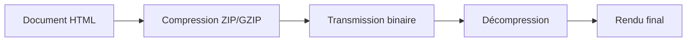
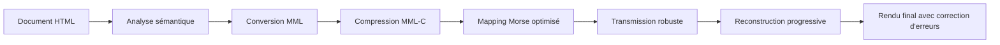

# 1.1 Vision du système : Une révolution dans la transmission de l'information

## La métaphore du télégraphe quantique

Imaginez que vous êtes au XIXe siècle, à l'époque où le télégraphe électrique révolutionnait les communications. Samuel Morse venait d'inventer son célèbre code, permettant de transmettre des messages à travers des milliers de kilomètres via des impulsions électriques simples : points et traits.

Maintenant, transportez-vous dans un monde futur où les réseaux informatiques modernes ont disparu. Plus d'internet, plus de satellites, plus de fibres optiques. Seulement des ondes radio, des connexions Bluetooth de courte portée, ou des réseaux mesh improvisés. Comment transmettrez-vous une page web complète, un document technique, ou même une simple liste de courses ?

Notre système MML-DNF-Morse représente exactement cette révolution : **transformer les protocoles de communication du XXIe siècle en impulsions télégraphiques du XIXe siècle, tout en préservant la richesse sémantique du contenu moderne**.

## L'architecture en couches : De l'HTML au Morse

### Couche 1 : Le contenu source (HTML, Markdown, texte structuré)

À la base de notre système se trouve le contenu que nous souhaitons transmettre. Contrairement aux approches traditionnelles qui compressent directement les octets, nous analysons d'abord la **structure sémantique** du document.

Prenons un exemple concret :

```html
<h1>Guide de survie en forêt</h1>
<p>En cas d'urgence, restez calme.</p>
<ul>
  <li>Trouvez un abri</li>
  <li>Allumez un feu</li>
</ul>
```

Ce n'est pas seulement du texte : c'est une **hiérarchie d'informations** avec des titres, des paragraphes, des listes. Cette structure porte un sens que nous devons préserver.

### Couche 2 : Le langage intermédiaire MML

Au lieu de comprimer directement le HTML, nous le transformons en MML (Minimal Markup Language), un langage de balisage spécialement conçu pour :

- **Minimiser la redondance** : Les balises répétitives sont optimisées
- **Préserver la sémantique** : La structure logique est maintenue
- **Faciliter la compression** : Format pré-optimisé pour les algorithmes de réduction

Notre exemple devient alors :

```
#H1 Guide de survie en forêt
#P En cas d'urgence, restez calme.
#UL
#LI Trouvez un abri
#LI Allumez un feu
```

### Couche 3 : La compression avancée (MML-C)

Nous appliquons ensuite des techniques de compression spécifiques au domaine :

- **Tokens lexicaux** : Remplacement des mots fréquents par des codes courts
- **Dictionnaire contextuel** : Adaptation à la langue et au domaine du document
- **Compression arithmétique** : Codage statistique optimisé

### Couche 4 : Le mapping Morse optimisé

Enfin, nous convertissons le résultat en code Morse, mais pas n'importe comment :

- **Fréquences d'apparition** : Les caractères courants utilisent les séquences les plus courtes
- **Redondance intelligente** : Détection et correction d'erreurs intégrées
- **Synchronisation** : Marqueurs temporels pour la reconstruction

## Pourquoi cette approche est révolutionnaire

### Traditionnellement : Compression binaire → Transmission brute



**Problème** : En cas d'erreur de transmission, tout le fichier devient inutilisable.

### Notre approche : Structure sémantique → Reconstruction intelligente



**Avantage** : Même avec 30% de pertes, le document reste lisible grâce à la redondance sémantique.

## La vision à long terme

Ce système n'est pas qu'un outil technique ; c'est une **philosophie de communication résiliente**. Dans un monde où les infrastructures numériques deviennent de plus en plus complexes et fragiles, nous proposons un retour aux sources : des protocoles simples, vérifiés, et universels.

Imaginez :
- Des radioamateurs échangeant des articles de journaux complets
- Des équipes de secours coordonnant des opérations via des réseaux mesh
- Des dissidents transmettant des informations dans des régimes autoritaires
- Des explorateurs partageant des cartes et des guides de survie

Tous utilisant le même langage universel : des points et des traits qui portent la connaissance humaine à travers les barrières technologiques et géographiques.

## L'élégance de la simplicité

Au fond, notre système incarne un principe fondamental de l'informatique : **la complexité peut être maîtrisée par la stratification**. Chaque couche résout un problème spécifique, et leur combinaison crée une solution robuste et élégante.

Comme le télégraphe de Morse qui transforma des impulsions électriques en langage humain, notre système transforme des ondes radio en documents riches et structurés, prouvant que les technologies anciennes et nouvelles peuvent coexister et se renforcer mutuellement.
