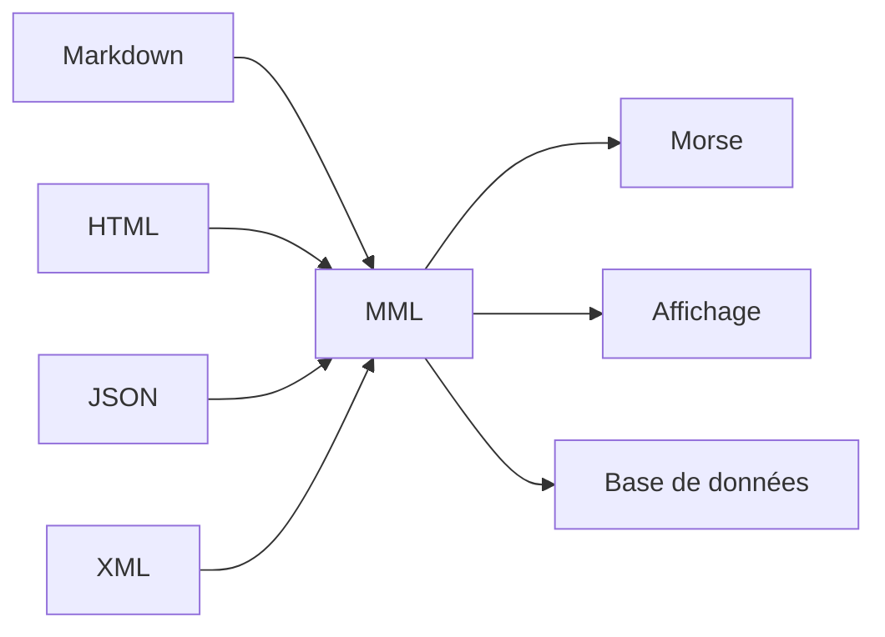

# 3.1 Philosophie du MML : La sémantique comme fondement de la transmission

## Au-delà de la syntaxe : Une révolution conceptuelle

### La tragédie des formats modernes

Observons un instantané de notre écosystème documentaire contemporain :

```html
<!-- HTML5 moderne -->
<article class="post" data-id="123" itemscope itemtype="http://schema.org/Article">
  <header>
    <h1 property="headline">Titre de l'article</h1>
    <time datetime="2024-01-15" property="datePublished">15 janvier 2024</time>
  </header>
  <section property="articleBody">
    <p>Ceci est un paragraphe avec <strong>texte en gras</strong> et <a href="/lien" rel="noopener">un lien</a>.</p>
  </section>
</article>
```

Ce code représente un **paradoxe technologique** :
- **Expressif** : Capable de représenter des structures complexes
- **Verbeux** : 15+ lignes pour un contenu simple
- **Fragile** : Dépendant de milliers de spécifications
- **Opaque** : La structure logique se noie dans la syntaxe

Le MML (Minimal Markup Language) naît de cette prise de conscience : **la complexité n'est pas un luxe, c'est un handicap**.

## Les principes fondateurs du MML

### Principe 1 : La primauté de la sémantique

#### Structure vs. Présentation

Le HTML traditionnel mélange deux préoccupations distinctes :

```html
<!-- Présentation + Structure mélangées -->
<div style="color: red; font-size: 24px; margin: 10px;">
  <strong>Texte important</strong>
</div>
```

Le MML sépare radicalement :

```mml
#H1 Texte important
```

**Règle fondamentale** : Un élément MML décrit **ce qu'est** l'information, pas **comment elle apparaît**.

#### Taxonomie sémantique pure

Chaque balise MML correspond à un concept universel :

| Balise | Signification sémantique | Usage |
|--------|--------------------------|-------|
| `#H1` | Titre principal | Hiérarchie documentaire |
| `#P` | Paragraphe | Unité discursive |
| `#UL` | Liste non ordonnée | Énumération sans ordre |
| `#LI` | Élément de liste | Item dans une collection |

### Principe 2 : L'économicité radicale

#### Le rasoir d'Occam numérique

**Principe** : Entre deux solutions équivalentes, choisir la plus simple.

**Application** : Chaque caractère dans MML doit justifier son existence.

```html
<!-- HTML : 47 caractères -->
<p class="intro">Hello world</p>

<!-- MML : 15 caractères -->
#P Hello world
```

**Gain** : **67% de réduction** pour la même information sémantique.

#### Élimination des redondances structurelles

Le HTML répète inlassablement les mêmes patterns :

```html
<ul>
  <li>Item 1</li>
  <li>Item 2</li>
  <li>Item 3</li>
</ul>
```

Le MML contextualise une fois pour toutes :

```mml
#UL
#LI Item 1
#LI Item 2
#LI Item 3
```

### Principe 3 : L'universalité transformatrice

#### Le pivot sémantique

MML agit comme un **langage pivot** dans l'écosystème documentaire :



**Propriété émergente** : Un document dans n'importe quel format peut être converti en MML, puis retransformé dans n'importe quel autre format sans perte sémantique.

#### Indépendance technologique

MML n'appartient à aucune plateforme, aucun vendeur :

- **Pas de dépendance** à un navigateur spécifique
- **Pas de bibliothèque** propriétaire requise
- **Pas d'évolution** imposée par un consortium
- **Pas d'obsolescence** programmée

### Principe 4 : La lisibilité humaine

#### Le paradoxe de la programmation

Les langages de programmation modernes sont conçus pour les machines, pas pour les humains :

```javascript
const element = document.createElement('div');
element.className = 'container';
element.innerHTML = '<p>Hello <strong>world</strong></p>';
document.body.appendChild(element);
```

Le MML restaure l'intelligibilité immédiate :

```mml
#DIV.container
#P Hello #STRONG world
```

**Critère** : Un document MML devrait être compréhensible par un humain non-technique.

## L'architecture philosophique du MML

### Couches d'abstraction

#### Couche 1 : Contenu brut
*Le texte et les médias purs*

#### Couche 2 : Structure sémantique (MML)
*La signification logique organisée*

#### Couche 3 : Optimisation de transmission (MML-C)
*La forme compressée pour le transport*

#### Couche 4 : Transport physique
*Les ondes, impulsions, signaux*

### L'élégance par la contrainte

Le MML s'impose des contraintes strictes qui génèrent l'élégance :

#### Contrainte d'atomicité
Chaque élément MML représente un **concept indivisible** :
- Pas de balises imbriquées complexes
- Chaque élément a une responsabilité unique
- La composition se fait par juxtaposition

#### Contrainte de linéarité
Le MML est fondamentalement **unidimensionnel** :
- Pas d'arbres complexes à maintenir
- Lecture séquentielle naturelle
- Facilite le streaming et la transmission fragmentée

#### Contrainte de minimalisme
**Règle des trois questions** :
1. Cette fonctionnalité est-elle essentielle ?
2. Peut-elle être exprimée plus simplement ?
3. Apporte-t-elle une valeur disproportionnée ?

## La métaphore organique : MML comme ADN documentaire

### L'ADN comme modèle de compression

L'ADN stocke l'intégralité des instructions pour construire un organisme complexe dans un volume microscopique. De même, MML condense la richesse sémantique d'un document dans une forme minimale.

#### Propriétés partagées

**Stabilité** :
- L'ADN reste lisible après des millions d'années
- Le MML reste compréhensible malgré les évolutions technologiques

**Redondance intelligente** :
- L'ADN contient des séquences répétées pour la réparation
- Le MML préserve la structure pour la reconstruction

**Efficacité** :
- L'ADN code 20 acides aminés avec 4 nucléotides
- Le MML représente des structures complexes avec des symboles simples

### Applications biologiques du concept

#### Résilience
Comme l'ADN résiste aux mutations, le MML résiste à la corruption :
- Perte partielle → Reconstruction possible
- Erreurs → Correction par contexte

#### Réplication
Comme l'ADN se duplique, le MML se transmet :
- Copie fidèle possible
- Distribution massive sans dégradation

#### Évolution
Comme l'ADN mute et évolue, le MML s'adapte :
- Extensions possibles sans casser l'existant
- Spécialisation pour des domaines particuliers

## Critique et réponses aux objections

### "Le MML est trop simpliste"

**Réponse** : La simplicité est une force, pas une faiblesse. Le HTML est complexe parce qu'il essaie de tout faire ; le MML est simple parce qu'il se concentre sur l'essentiel.

**Analogie** : Le piano a 88 touches, pas 1000. Cette limitation n'a pas empêché Bach ou Chopin de créer des chefs-d'œuvre.

### "Le MML manque de fonctionnalités avancées"

**Réponse** : Les fonctionnalités "avancées" du HTML sont souvent des solutions à des problèmes artificiels. Le MML force à penser sémantiquement plutôt que présentativement.

**Exemple** : Au lieu de 50 propriétés CSS pour styliser un bouton, le MML offre une balise `#BUTTON` avec une sémantique claire.

### "Le MML est une régression technologique"

**Réponse** : Au contraire, c'est une progression philosophique. Nous ne rejetons pas la technologie ; nous la transcendons par la compréhension profonde.

**Preuve** : Les systèmes les plus évolués (cerveau humain, écosystèmes) fonctionnent avec des principes simples appliqués de manière élégante.

## L'impact philosophique du MML

### Redéfinition de la "progression technologique"

Le MML nous invite à reconsidérer notre définition du progrès :

**Ancien paradigme** :
- Plus de fonctionnalités = Mieux
- Plus de complexité = Plus puissant
- Plus d'options = Plus flexible

**Nouveau paradigme MML** :
- Moins de complexité = Plus robuste
- Fonctionnalités essentielles = Plus puissant
- Contraintes intelligentes = Plus créatif

### Implications sociétales

#### Démocratisation de la publication
- Outils simples pour créer du contenu structuré
- Pas besoin d'expertise technique avancée
- Accessibilité universelle

#### Résilience informationnelle
- Documents qui survivent aux changements technologiques
- Transmission possible dans les environnements les plus hostiles
- Préservation de la connaissance humaine

#### Économie de l'attention
- Contenu qui va à l'essentiel
- Structure claire qui facilite la compréhension
- Réduction du bruit informationnel

## Conclusion : MML comme manifeste philosophique

Le MML n'est pas seulement un langage de balisage ; c'est un **manifeste contre la complexité gratuite**. Dans un monde où la technologie nous promet toujours plus pour nous donner toujours moins, le MML nous rappelle que la véritable puissance vient de la maîtrise, pas de l'accumulation.

Comme les arts martiaux qui enseignent que la force véritable vient du contrôle, pas de la musculature, le MML démontre que l'efficacité véritable vient de l'élégance, pas de la complication.

Le MML n'est pas une fin en soi ; c'est un **commencement**. Un commencement vers des systèmes qui servent l'humain plutôt que l'inverse, qui durent plutôt que s'effondrer, qui communiquent plutôt que complexifient.

Dans l'histoire de l'informatique, le MML pourrait bien être remembered non pas comme une technologie de plus, mais comme le **moment où nous avons commencé à penser différemment**.
